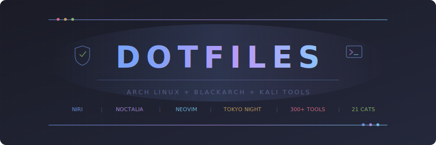
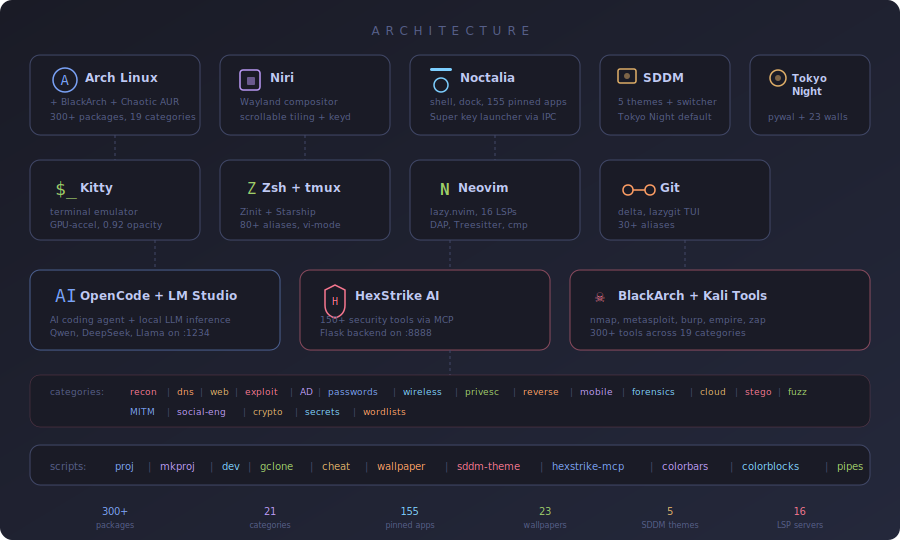
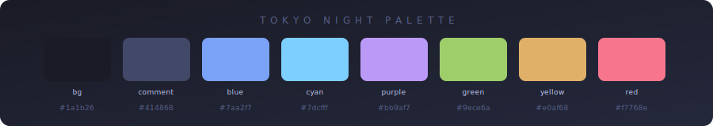

<p align="center">
  
</p>

<p align="center">
  
  
  
  
  
  
  
  
  
  
  
</p>

<p align="center">
  Personal dotfiles for a scrollable-tiling Wayland desktop built for coding and offensive security.
</p>


## Stack



| Layer | Tool |
|---|---|
| Distro | Arch Linux + [BlackArch](https://blackarch.org) + [Chaotic AUR](https://aur.chaotic.cx) repos |
| Compositor | [Niri](https://github.com/YaLTeR/niri) (scrollable tiling, Wayland) |
| Desktop Shell | [Noctalia](https://github.com/noctalia-dev/noctalia-shell) (bar, dock, panels, notifications, lock screen) |
| Terminal | Kitty |
| Multiplexer | tmux (Ctrl-a prefix, lazygit/btop/fzf popups) |
| Shell | Zsh + Zinit + Starship |
| Editor | Neovim (lazy.nvim, 16 LSP servers, DAP, Treesitter) |
| AI / LLM | [LM Studio](https://lmstudio.ai) (local models) + [OpenCode](https://opencode.ai) (AI coding agent) |
| AI Security | [HexStrike AI](https://github.com/0x4m4/hexstrike-ai) MCP (150+ security tools via MCP) |
| Git | delta side-by-side diffs, 30+ aliases, lazygit TUI |
| Launcher | Fuzzel |
| Display Manager | [SDDM](https://github.com/sddm/sddm) (breeze theme, Niri session auto-detected) |
| Theme | Tokyo Night (dark, transparent) + [pywal](https://github.com/dylanaraps/pywal) (wallpaper-driven colors) |
| Fetch | neofetch (Arch ASCII, system info on shell start) |


## Quick Start

**One-liner (fresh Arch install):**

```bash
curl -fsSL https://raw.githubusercontent.com/foolish-dev/dotfiles/main/bootstrap.sh | bash
```

**Manual install:**

```bash
git clone https://github.com/foolish-dev/dotfiles.git ~/dotfiles
cd ~/dotfiles
./install.sh    # Arch only -- adds BlackArch + Chaotic AUR repos, installs 250+ packages
./deploy.sh     # symlinks all configs into ~/.config/
```

First `nvim` launch auto-installs all plugins and LSP servers.


## Layout

```
.config/
  niri/config.kdl              compositor keybinds, layout, window rules
  noctalia/
    settings.json              bar, dock, panels, launcher settings
    colors.json                Tokyo Night material colors (pywal-managed)
  nvim/
    init.lua                   lazy.nvim bootstrap
    lua/config/                options, keymaps, autocmds
    lua/plugins/               colorscheme, treesitter, lsp, editor, ui, coding
  kitty/kitty.conf             terminal (0.92 opacity, pywal + Tokyo Night fallback)
  tmux/tmux.conf               multiplexer (vim nav, popups, Tokyo Night)
  lazygit/config.yml           git TUI (delta pager, Tokyo Night)
  fuzzel/fuzzel.ini            app launcher
  starship.toml                prompt
  opencode/opencode.json       AI agent config (LM Studio provider, HexStrike MCP)
  wal/templates/               pywal templates (kitty, noctalia)
  neofetch/config.conf         system fetch display
  systemd/user/                cliphist, swww, hexstrike-server services
.zshrc                         shell -- 80+ aliases, BlackArch tool shortcuts, pywal init
.gitconfig                     delta diffs, 30+ aliases, nvim mergetool
.gitignore_global              universal project ignores
.editorconfig                  per-language formatting rules
.local/bin/
  proj                         fuzzy project opener (fzf + tmux)
  mkproj                       scaffold projects (python/rust/go/c/node/shell)
  dev                          3-pane tmux IDE session
  gclone                       smart git clone (gh:user/repo shorthand)
  cheat                        quick reference sheets
  wallpaper                    set wallpaper + regenerate pywal colors + reload kitty/noctalia
  hexstrike-mcp                MCP stdio bridge to HexStrike AI server
etc/sddm.conf.d/niri.conf      SDDM display manager config (deployed to /etc)
bootstrap.sh                   one-liner installer (curl | bash)
install.sh                     Arch + BlackArch + Chaotic AUR package bootstrap
deploy.sh                      symlink deployer with auto-backup
```


## Keybinds

### Niri (compositor)

| Key | Action |
|---|---|
| `Super+Return` | Terminal |
| `Super+D` | Launcher |
| `Super+B` | Firefox |
| `Super+N` | Neovim |
| `Super+H/J/K/L` | Focus window |
| `Super+Shift+H/J/K/L` | Move window |
| `Super+1-9` | Workspace |
| `Super+F` | Maximize |
| `Super+Shift+F` | Fullscreen |
| `Super+Q` | Close window |
| `Super+V` | Clipboard history |
| `Super+Escape` | Lock screen |
| `Super+Ctrl+M` | msfconsole |
| `Super+Ctrl+W` | Wireshark |
| `Super+Ctrl+B` | Burp Suite |
| `Super+Ctrl+T` | btop |
| `Super+Ctrl+A` | LM Studio |
| `Print` | Screenshot |

### Tmux (prefix = Ctrl-a)

| Key | Action |
|---|---|
| `C-a \|` | Split horizontal |
| `C-a -` | Split vertical |
| `C-a h/j/k/l` | Navigate panes |
| `C-a g` | Lazygit popup |
| `C-a b` | btop popup |
| `C-a f` | fzf file opener |
| `C-a c` | New window |
| `C-a Tab` | Last window |
| `C-a S` | New session |


## Neovim

**LSP servers** (auto-installed via Mason):
pyright, ruff, clangd, rust_analyzer, gopls, zls, ts_ls, bashls, lua_ls, html, cssls, jsonls, yamlls, dockerls, terraformls, tailwindcss

**DAP debuggers**: Python (debugpy), C/C++/Rust (GDB)

**Key plugins**: Telescope, Neo-tree, Gitsigns, Trouble, Bufferline, Lualine, Noice, nvim-cmp, LuaSnip, Conform (format-on-save), hex.nvim, rest.nvim, toggleterm, diffview

| Key | Action |
|---|---|
| `<leader>ff` | Find files |
| `<leader>fg` | Live grep |
| `<leader>t` | File tree |
| `<leader>xH` | Hex editor |
| `<leader>db` | Toggle breakpoint |
| `<leader>dc` | Debug continue |
| `<leader>gg` | Git status |
| `<leader>cf` | Format buffer |
| `<leader>xx` | Diagnostics |
| `<C-\>` | Float terminal |


## LM Studio

Local LLM inference via [LM Studio](https://lmstudio.ai). The installer pulls `lmstudio-bin` from Chaotic AUR.

OpenCode is pre-configured as a provider (`http://127.0.0.1:1234/v1`) with starter models in `.config/opencode/opencode.json`. Load a model in LM Studio, start the server, then use `/models` in OpenCode.

```bash
lms                    # open LM Studio GUI
lms-server             # start headless API server on :1234
lms-stop               # stop the server
lms-status             # list loaded models
lms-chat               # quick test curl
```


## HexStrike AI MCP

[HexStrike AI](https://github.com/0x4m4/hexstrike-ai) exposes 150+ offensive security tools to AI agents via MCP.

The installer clones the repo to `~/tools/hexstrike-ai`, sets up a Python venv, and enables a systemd user service (`hexstrike-server.service`) running the Flask backend on `127.0.0.1:8888`. OpenCode connects through the `hexstrike-mcp` stdio bridge.

```bash
sysu status hexstrike-server   # check service status
sysu restart hexstrike-server  # restart the backend
```


## Pywal

[pywal](https://github.com/dylanaraps/pywal) generates a color scheme from your wallpaper and applies it to kitty, noctalia, and the terminal.

```bash
wallpaper ~/Pictures/bg.jpg    # set wallpaper + regenerate all colors
```

The `wallpaper` script:
1. Runs `wal -i` to generate colors
2. Sets the wallpaper via `swww img` with a grow transition
3. Live-reloads kitty colors
4. Copies the generated `colors-noctalia.json` into noctalia's config

Tokyo Night is the static fallback before the first `wal` run.


## BlackArch Tools

The installer adds the BlackArch repository and pulls tools across 12 categories:

| Category | Tools |
|---|---|
| Recon/OSINT | theharvester, sherlock, recon-ng, spiderfoot, katana, gau, waybackurls, hakrawler |
| Web | wpscan, commix, dalfox, arjun, jwt-tool, nosqlmap, graphqlmap, paramspider |
| Exploitation | evil-winrm, sliver, routersploit, searchsploit, crackmapexec |
| Passwords | hashcat-utils, hcxtools, cewl, crunch, medusa, patator |
| Wireless | bettercap, wifite, reaver, fluxion, airgeddon |
| Privesc | linpeas, winpeas, pspy, mimikatz, bloodhound, chisel, ligolo-ng |
| Reversing | rizin, cutter, angr, ropper, one_gadget, retdec |
| Forensics | autopsy, yara, bulk-extractor, oletools |
| Social Eng | SET, gophish, evilginx2 |
| Crypto | hashpump, rsactftool, xortool |
| Stego | stegseek, zsteg, stegsolve |
| Fuzzing | afl++, boofuzz, radamsa |


## Chaotic AUR

[Chaotic AUR](https://aur.chaotic.cx) provides pre-built AUR packages so you skip compilation. The installer adds the repo automatically (GPG key + mirrorlist + pacman.conf entry). Packages like `lmstudio-bin`, `opencode-bin`, and many others install instantly via pacman.


## Zsh Security Toolkit

```bash
# Quick reference
cheat blackarch                    # BlackArch tools overview
cheat privesc                      # Privilege escalation
cheat ad                           # Active Directory attacks
cheat revshells                    # Reverse shell one-liners

# Functions
revshell 10.10.14.1 4444           # Generate bash/python/nc/ps reverse shells
listen 4444                        # nc listener
serve 8000                         # Python HTTP server
recon example.com                  # Whois + DNS summary
quickscan 10.10.10.0/24            # Ping sweep
hashid <hash>                      # Identify hash type

# Dev scripts
proj                               # Fuzzy open a project in tmux
mkproj myapp python                # Scaffold a Python project
dev                                # Launch 3-pane tmux IDE
gclone user/repo                   # Clone from GitHub + cd

# Pywal / theming
wallpaper ~/Pictures/bg.jpg        # Set wallpaper + regenerate colors

# LM Studio
lms                                # Open LM Studio
lms-server                         # Start local API server
lms-status                         # Show loaded models

# Aliases (samples)
nmap-stealth 10.10.10.1            # SYN scan, fragmented
msf                                # msfconsole -q
wpscan-enum http://target          # WordPress full enum
evilwinrm -i IP -u user -p pass   # WinRM shell
lg                                 # lazygit
```

## Color Palette




<p align="center">
  <sub>MIT License &copy; <a href="https://github.com/foolish-dev">foolish-dev</a></sub>
</p>
